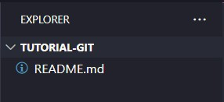

# Tutorial Git e GitHub

## Objetivos

O objetivo desse repositório é ensinar os primeiros passos, desde a configuração até o uso diário, do git, com apoio da plataforma [GitHub](https://github.com).


# O que é o Git e GitHub?

## Git

É um software de código aberto para controle de versões de arquivos, apesar de ser voltado à área de desenvolvimento de software, ele pode ser utilizado para quaisquer tipos de arquivos, por exemplo, versionamento de documentos e trabalhos de conclusão de curso.<br>


O [Git](https://git-scm.com) foi publicado originalmente em abril de 2005 e foi desenvolvido pelo mesmo desenvolvedor do linux, [Linus Torvalds](https://github.com/torvalds), atualmente é o sistema de versionamento mais utilizado por uma ampla gama de profissionais na área.

> Esse sistema possui uma série de diferenciais quando comparado a outros softwares de versionamento, caso queira saber mais, [veja aqui](https://www.atlassian.com/br/git/tutorials/what-is-git).

## GitHub

É uma plataforma de hospedagem de código fonte, amplamente utilizada por milhares de usuários diariamente, tanto para projetos pessoais ou faculdade, qunato para uso profissional e código aberto.


A empresa foi fundada em 2008, sendo posteriormente adiquirida pela Microsoft, tendo crescido tanto que em julho de 2022 tinha cerca de 83 milhões de usuários na plataforma.

# Primeiros Passos

## Conta no GitHub

Antes de tudo, já crie sua conta no [GitHub](https://github.com), ela é gratuita, mas vale a pena linkar seu email da sua instituição de ensino, você pode ganhar diversos benefícios, entre eles o GitHub PRO, que te permite ter ilimitados repositoriórios privados (sem o PRO só se pode ter 1 por conta).

---

## Instalação do Git

O Git pode ser instalado em todos os principais sistemas operacionais da atualidade, sendo presente nativamente no Mac e kernel Linux.

Antes de se instalar, verifique se o seu sistema já não possui o git instalado, para isso, abra o terminal e digite o comando:

```
$ git version
```

Caso tenha o git instalado, ele vai imprimir na tela a versão instalada no seu computador no seguite formato:

```
> git version 2.35.1.windows.2
```

Caso o Git não esteja instalado, ele mostrará o erro que o comando "git" não é conhecido. Logo, o mesmo deve ser instalado [clicando aqui](https://git-scm.com/downloads).

## Configuração do ambiente

Com o git instalado, agora deve-se configurar o usuario e e-mail para poder utilizar o mesmo.

### Definição do usuário:

Abra o terminal e digite o seguinte comando:

``` C++
$ git config --global user.name "Seu usuario" 
// substitua pelo seu nome de usuário
```

Para confirmar se o usuario foi cadastrado corretamente, execute o seginte comando, que deve retornar o seu usuário criado:

```
$ git config --global user.name

> Seu usuario
```

### Definição do Email

Abra o terminal e digite o seguinte comando:

``` C++
$ git config --global user.email "seu.email@exemplo.com" 
// substitua pelo seu email
```

Para confirmar se o email foi cadastrado corretamente, execute o seginte comando, que deve retornar o seu email cadastrado

```
$ git config --global user.email

> seu.email@exemplo.com
```

# Criando seu primeiro repositório

## O que é um repositório?

Um repositório, muitas vezes chamado de repo, é um diretório especial que possui uma sub-pasta oculta ".git/" que armazena todo o histórico do seu projeto, por isso, pense muito bem antes de mexer com ela.

## Como criar um repositório

Para criar o seu primeiro repo, é recomendado segui os seguintes passos:

1. Crie uma nova pasta no seu computador, pode ser com qualquer nome, utilizaremos "tutorial-git" durante esse guia.

2. Abra a pasta criada no seu editor de preferência, aqui usaremos o VScode.

3. Crie um arquivo "README.md", esse arquivo estará presente em praticamente todos os repositórios que você ver, ele é utilizado para passar quaisquer informações uteis sobre o repositório para os usuários e contribuidores dele.
    - A extensão ".md" do arquivo criado, se refere a liguagem de marcação "MarkDown", com marcadores faceis de se entender e utilizar, outro exemplo de linguagem de marcação é o HTML, muito usado em desenvolvimento WEB.

4. No arquivo criado, escreva a descrição do repositório, por exemplo:
    ```
    Este é o meu primeiro repositório git!
    ```
5. Não se esqueça de salvar o arquivo depois da edição!

6. Seu repositório deve estar assim:

    

7. Abra o terminal na pasta desejada
   
    - No windows, com a pasta aberta no explorador de arquivos, pode-se abrir direto na pasta desejada ao digitar "cmd" e confirmando no enredeço do diretório

8. utilize o seguinte comando para inicializar seu repo:
    ```
    $ git init
    ```
9. Caso seja bem sucedido, o comando retornará o seguinte resultado:
    ``` C++
    >  Initialized empty Git repository in {path}/tutorial-git/.git/
    ```

### Pronto, com isso, seu repositório está criado, com sua pasta /.git adicionada. Agora tá na hora de conhecer o que o git tem a oferecer.

# Como utilizar o seu repositório?


# Desafio


